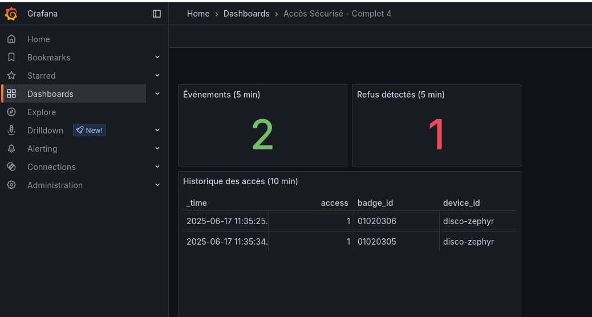

## Giga Factory Intégration 2

* Package Application embarquée
* Package Authentification centralisée
* Package Supervision

## Configuration

* Ne pas oublier de configurer SSID et MDP wifi dans wifi.c
* Ne pas oublier de configurer adresse du serveur HTTP dans http.c

## Validation

### Containers

Il y a deux projets, un pour le Package Authentification, l'autre pour le Package Supervision.

Les deux projets docker partagent le même réseau `s10_net` pour que les containers communiquent correctement.

**Bien démarrer les containers du package Authentification avant ceux du Package Supervision**


#### Package Authentification

1. Démarrer les containers (ne pas oublier le --build, app.py a été modifié)

```
cd flask-openldap-lam
docker compose up -d --build
```

#### Package supervision

2. Démarrer les containers

```
cd conso-http_telegraf-influxdb-grafana
docker compose up -d
```

#### App Embarquée

3. Compiler et flasher la carte disco

## Vérification

* Lors d'un scan de badge

### Vérification 1

Les requêtes HTTP sont relayées et consommées par Telegraf

* Logs de Telegraf

~~~ shell
2025-06-17T08:57:46Z D! [outputs.influxdb_v2] Buffer fullness: 0 / 10000 metrics
2025-06-17T08:57:56Z D! [outputs.influxdb_v2] Buffer fullness: 0 / 10000 metrics
2025-06-17T08:58:06Z D! [outputs.influxdb_v2] Wrote batch of 1 metrics in 63.708234ms
~~~

### Vérification 2

Les données sont présentes sur le Dashboard




Projet versionné sur Github